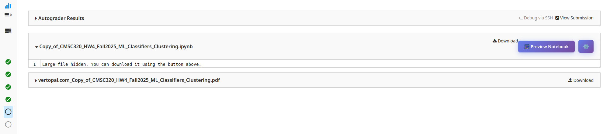
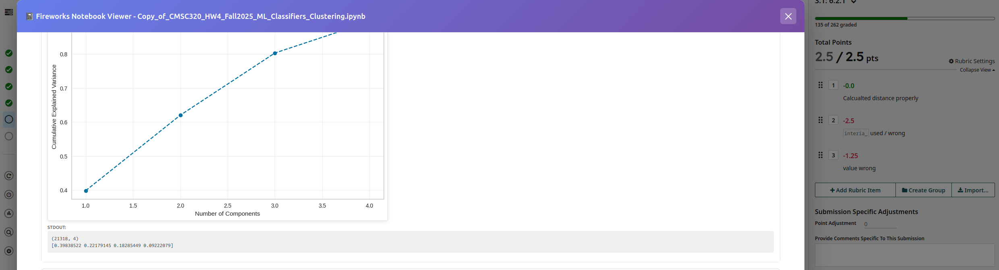
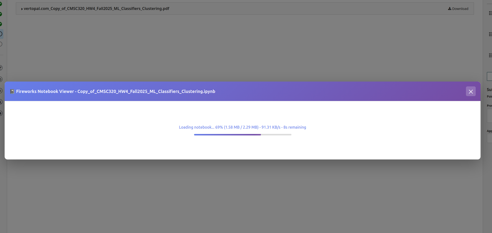
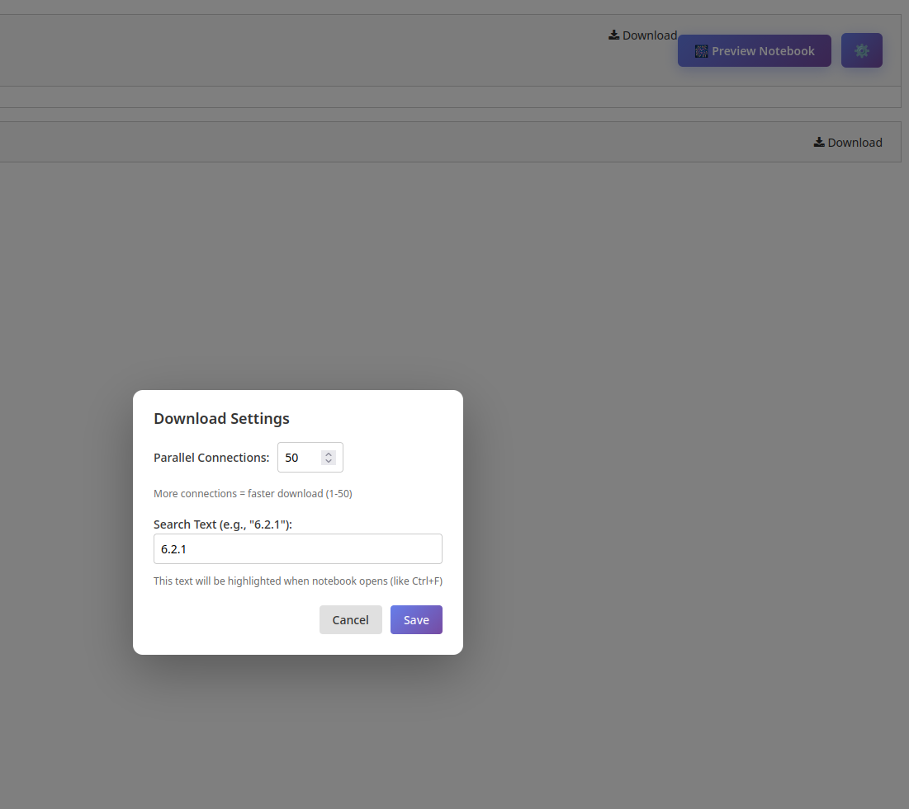

# Fireworks - Gradescope Large File Viewer

A browser extension that enhances the Gradescope experience by allowing you to preview large Jupyter notebooks directly in the browser without downloading them. Works on both Chrome and Firefox.

## Problem Statement

Gradescope hides notebook files larger than 1MB and displays the message **"Large file hidden. You can download it using the button above."** instead of showing the notebook content. This extension solves this issue by:

- Automatically detecting and loading large `.ipynb` notebook files
- Providing an in-browser preview without requiring downloads
- Enabling seamless grading workflow for large notebook submissions
- Supporting files of any size through parallel multi-chunk downloading

## Features

1. **Preview Large Notebook**: View Jupyter notebooks directly in Gradescope without downloading. Automatically skips PDF files and only processes actual `.ipynb` notebooks.

   
   

2. **User-Defined Multi-Chunks Download**: Configure parallel download connections (1-50) for faster loading. Default is 20 connections with real-time progress bar.

3. **Jump to Question Keywords**: Define search keywords in settings (e.g., "6.2.1") that automatically highlight and scroll to when notebook opens - works like Ctrl+F but automatic.

4. **Switch Page with 'z' Without Closing Window**: Navigate between student submissions using Gradescope's 'z' key. The viewer automatically reloads with the new student's notebook.
   


## Installation

### Chrome Installation

1. Open Chrome and navigate to `chrome://extensions/`
2. Enable **Developer mode** (toggle in the top-right corner)
3. Click **"Load unpacked"**
4. Select the `chrome-extension` folder (the one containing `manifest.json`)
5. The extension will be loaded and ready to use!

**Note**: Chrome version uses Manifest V3 and has been tested.

### Firefox Installation

#### Method 1: Temporary Installation (Recommended for Testing)

1. Open Firefox and navigate to `about:debugging`
2. Click **"This Firefox"** in the left sidebar
3. Click **"Load Temporary Add-on..."**
4. Navigate to the `firefox-addon` folder and select the `manifest.json` file
5. The extension will be loaded temporarily (until Firefox restarts)

**Note**: Firefox version has been tested under debug mode.

#### Method 2: Using .xpi File (Currently Not Available)

**Note**: The `.xpi` file is not signed, so it cannot be installed in Firefox without special developer settings. Use Method 1 (Temporary Installation) instead for now.

If you have a pre-built `.xpi` file and want to install unsigned extensions:
1. Open Firefox and navigate to `about:config`
2. Search for `xpinstall.signatures.required`
3. Set it to `false` (not recommended for security reasons)
4. Then you can install the `.xpi` file by:
   - Pressing `Ctrl+Shift+A` (or `Cmd+Shift+A` on Mac) to open Add-ons Manager
   - Dragging and dropping the `.xpi` file into Firefox
   - Clicking **"Add"** to install

**Warning**: Disabling signature requirements reduces browser security. Only do this in development/test environments.

## Usage

1. Navigate to a Gradescope assignment page with notebook submissions
2. Look for the **🎆 Preview Notebook** button next to notebook download links
3. Click the button to open the notebook viewer
4. Use the **⚙️** gear icon to configure:
   - Parallel download connections (1-50)
   - Search keywords for auto-jump feature
5. When grading multiple submissions:
   - Open the notebook viewer for the first student
   - Press **'z'** to navigate to the next student
   - The viewer automatically reloads with the new student's notebook

## Settings

Access settings by clicking the **⚙️** gear icon on the Gradescope page.



### Parallel Connections
- Range: 1-50 connections
- Higher values = faster download but more network usage
- Recommended: 20 (default)
- Useful for very large notebooks (>50MB)
- Automatically uses single connection for small files (<1MB)

### Search Text
- Enter keywords to automatically jump to when notebook opens
- Examples: "6.2.1", "Question 3", "Part A"
- Case-insensitive search
- Automatically highlights and scrolls to first match
- Works with markdown headers, code cells, and output text

## Technical Details

- **Manifest Version**: 
  - Chrome: Manifest V3 (uses service worker)
  - Firefox: Manifest V2 (uses persistent background script)
- **Content Script**: Injected on Gradescope pages at document_start
- **Background Script**: Handles notebook fetching with parallel downloads and CORS bypass
  - Chrome: Service worker (non-persistent)
  - Firefox: Persistent background script
- **Storage**: Uses browser's local storage for settings persistence
- **CORS**: Background script handles cross-origin requests to S3
- **File Detection**: Validates file type (PDF vs notebook) before parsing
- **Navigation**: Monitors URL changes and SPA navigation for auto-reload
- **Browser API**: Uses browser-specific APIs (Chrome/Firefox compatible)

## Browser Compatibility

- ✅ Chrome (tested, uses Manifest V3)
- ✅ Firefox (tested under debug mode, uses Manifest V2)
- Both versions are in separate folders:
  - `chrome-extension/` - Chrome version (Manifest V3)
  - `firefox-addon/` - Firefox version (Manifest V2)

## Known Issues & Solutions

- **PDF files**: The extension automatically detects and skips PDF files. Only actual `.ipynb` notebooks will be previewed.
- **Large files**: Use higher parallel connections (30-50) for files >100MB
- **Search not working**: Make sure the keyword exists in the notebook. The search is case-insensitive and works with rendered markdown.
- **Firefox temporary add-on**: Remember that temporary add-ons are removed when Firefox restarts. Reload after restart.
- **Markdown Rendering**: Some markdown is not render correctly.

## Development

This extension is designed for debug/development use.

## Troubleshooting

### General Issues

- **Notebooks not showing**: Check browser console for errors (F12 → Console tab)
- **Download slow**: Increase parallel connections in settings (try 30-50 for large files)
- **Search not working**: Ensure keyword exists in notebook and check spelling
- **PDF error messages**: The extension correctly identifies PDFs. Look for actual `.ipynb` file links.
- **Auto-reload not working**: Make sure you're using Gradescope's 'z' key navigation, not browser back/forward

### Chrome-Specific

- **Extension not loading**: Make sure Developer mode is enabled in `chrome://extensions/`
- **Extension disabled**: Check for errors in `chrome://extensions/` and reload if needed

### Firefox-Specific

- **Extension not loading**: Make sure you're using `about:debugging` and loading the `manifest.json` file
- **Extension removed after restart**: This is normal for temporary add-ons. Reload it from `about:debugging`

## Building Firefox .xpi File

To create a distributable `.xpi` file for Firefox:

1. Zip all files in the `firefox-addon` directory (manifest.json, content.js, background.js, styles.css)
2. Rename the `.zip` file to `.xpi`
3. **Note**: The `.xpi` file is not signed, so it cannot be installed normally. You would need to disable signature requirements in Firefox (`about:config` → `xpinstall.signatures.required` = `false`), which is not recommended for security reasons. Use the temporary installation method (Method 1) instead.

## File Structure

```
/
├── chrome-extension/      # Chrome version
│   ├── manifest.json
│   ├── content.js
│   ├── background.js
│   └── styles.css
├── firefox-addon/         # Firefox version
│   ├── manifest.json
│   ├── content.js
│   ├── background.js
│   └── styles.css
└── *.xpi                   # Pre-built Firefox extension (if available)
```

## License

Debug/Development use only. Not for browser store distribution (unless properly signed and packaged).

# fireworks
